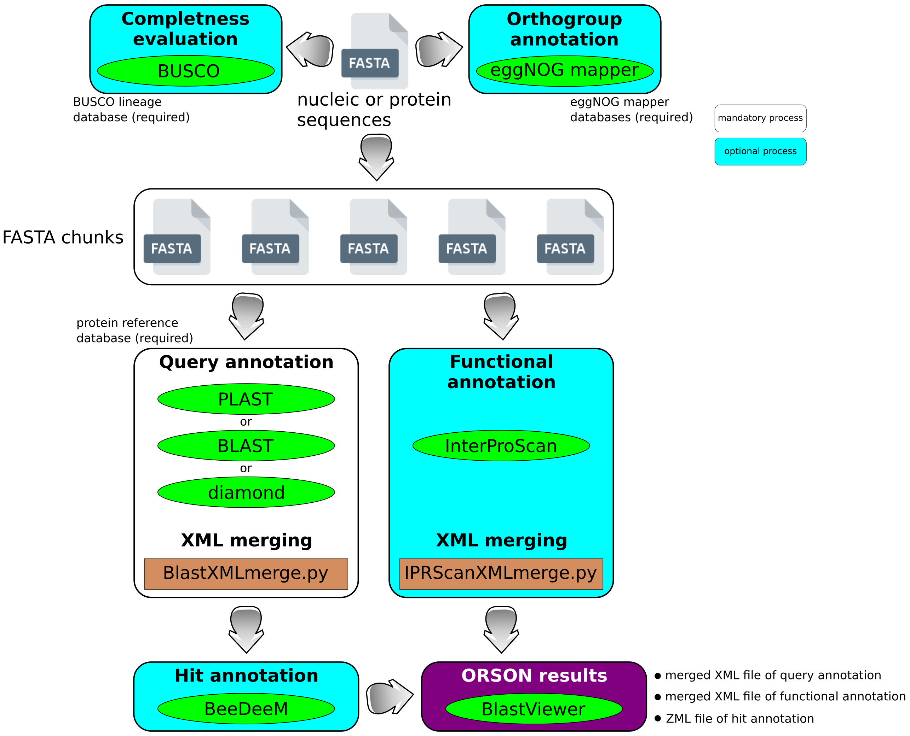

# **ORSON: workflow for prOteome and tRanScriptome functiOnal aNnotation**.

[](https://github.com/ifremer-bioinformatics/orson)
[](https://www.nextflow.io/)
[](https://sylabs.io/docs/)
[](https://ifremer-bioinformatics.github.io/)

## Introduction

ORSON combine state-of-the-art tools for annotation processes within a [Nextflow](https://www.nextflow.io) pipeline: sequence similarity search ([PLAST](https://plast.inria.fr/), [BLAST](https://blast.ncbi.nlm.nih.gov/Blast.cgi?CMD=Web&PAGE_TYPE=BlastDocs&DOC_TYPE=Download) or [Diamond](https://github.com/bbuchfink/diamond)), functional annotation retrieval ([BeeDeeM](https://github.com/pgdurand/BeeDeeM)) and functional prediction ([InterProScan](https://interproscan-docs.readthedocs.io/en/latest/HowToDownload.html)). When required, [BUSCO](https://busco.ezlab.org/) completness evaluation and [eggNOG](https://github.com/eggnogdb/eggnog-mapper) Orthogroup annotation can be activated. While ORSON results can be analyzed through the command-line, it also offers the possibility to be compatible with [BlastViewer](https://github.com/pgdurand/BlastViewer/) or [Blast2GO](https://www.biobam.com/blast2go-basic/) graphical tools.

The ORSON pipeline can run tasks across multiple compute infrastructures in a very portable manner. It comes with singularity containers making installation trivial and results highly reproducible.

## Quick Start

i. Install [`nextflow`](https://www.nextflow.io/docs/latest/getstarted.html#installation)

ii. Install [`Singularity`](https://www.sylabs.io/guides/3.0/user-guide/) for full pipeline reproducibility

iii. Download the pipeline and test it on a minimal dataset with a single command

```bash
nextflow run main.nf -profile test,singularity
```

> To use this workflow on a computing cluster, it is necessary to provide a configuration file for your system. For some institutes, this one already exists and is referenced on [nf-core/configs](https://github.com/nf-core/configs#documentation). If so, you can simply download your institute custom config file and simply use `-c <institute_config_file>` in your command. This will enable either `docker` or `singularity` and set the appropriate execution settings for your local compute environment.

iv. Start running your own analysis!

```bash
nextflow run main.nf -profile custom,singularity [-c <institute_config_file>]
```

See [usage docs](docs/usage.md) for a complete description of all of the options available when running the pipeline.

## Documentation

This workflow comes with documentation about the pipeline, found in the `docs/` directory:

1. [Introduction](docs/usage.md#introduction)
2. [Pipeline installation](docs/usage.md#install-the-pipeline)
    * [Local installation](docs/usage.md#local-installation)
    * [Adding your own system config](docs/usage.md#your-own-config)
3. [Running the pipeline](docs/usage.md#running-the-pipeline)
4. [Output and how to interpret the results](docs/output.md)
5. [Troubleshooting](docs/troubleshooting.md)

Here is an overview of the many steps available in orson pipeline:



## Requirements

To use ORSON, all tools are automatically installed via pre-built singularity images available at [SeBiMER ftp](ftp://ftp.ifremer.fr/ifremer/dataref/bioinfo/sebimer/tools/ORSON/); these images are built from recipes available [here](/containers). 

Databases are also automatically download according to user's choice (default: Enzyme, UniProt SwissProt). See the [Installing annotated sequence banks](/docs/usage.md#installing-annotated-sequence-banks) section of the usage documentation.

However, you must have local access to the BUSCO lineage databases. To download them, please refer to the tool's documentation to [download the lineage databases](https://busco.ezlab.org/busco_userguide.html#download-and-automated-update)

## Credits

ORSON is written by [SeBiMER](https://ifremer-bioinformatics.github.io/), the Bioinformatics Core Facility of [IFREMER](https://wwz.ifremer.fr/en/).

## Contributions

We welcome contributions to the pipeline. If such case you can do one of the following:
* Use issues to submit your questions 
* Fork the project, do your developments and submit a pull request
* Contact us (see email below) 

## Support

For further information or help, don't hesitate to get in touch with the orson developpers: 


